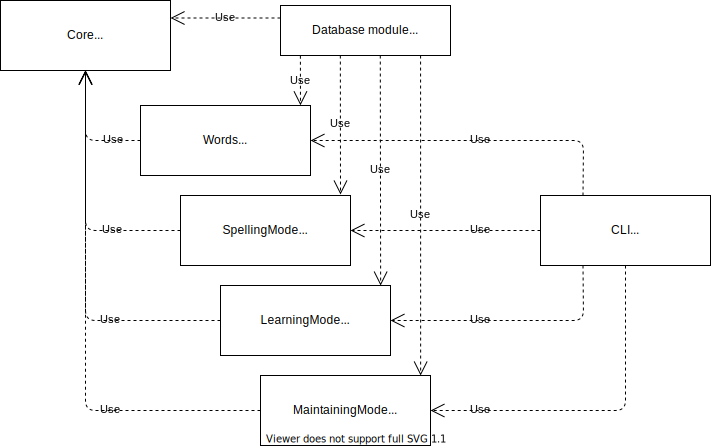

# Lexica - programming project

## Modules



## Lexica.Core.dll

Namespace:

- Lexica.Core

Classes:

- Config
  - AppSettings.cs
- Data
  - IDataSource.cs
  - JsonSource.cs
- Exceptions
  - WrongConfigExceptions.cs
- Extensions:
  - ListExtensions.cs
  - StringExtensions.cs
- IO
  - ISource.cs
  - FileSource.cs
  - EmbeddedSource.cs
  - IMultipleSource.cs
  - MultipleFilesSource.cs
  - MultipleEmbeddedSource.cs
- Models
  - AnswerResult.cs
  - Error.cs
  - ErrorCodesEnum.cs
  - MergeModeEnum.cs
  - OperationResult.cs
  - Question.cs
  - QuestionTypeEnum.cs
- Validators
  - Models
    - GeneralValidationData.cs
    - NumberValidationData.cs
    - StringValidationData.cs
  - IValidator.cs
  - NumberValidator.cs
  - StringValidator.cs

## Lexica.CoreTests (xUnit)

Namespace:

- Lexica.Core.Tests

Classes:

- AppSettingsTests.cs
  - Init_WrongConfiguration_ThrowsWrongConfigException(
      string configPath,
      string schemaPath,
      Dictionary\<string, string\> expectedExceptionDetails)
  - Get_CorrectConfiguration_ReturnsSettingsObject(
      string configPath,
      string schemaPath,
      Settings expectedSettings)
- SourceTests.cs
  - Init_NotExistedFile_ThrowsFileNotFoundException(string filePath)
  - Init_NotExistedEmbeddedResource_ThrowsFileNotFoundException(string resourcePath)
  - GetMultipleFiles_CorrectPath_ReturnsProperContents(string dirPath, List\<string\> expectedContents)
  - GetMultipleFiles_CorrectPath_ReturnsProperNames(string dirPath, List\<string\> expectedNames)
  - GetMultipleEmbeddedFiles_CorrectPath_ReturnsProperContents(string dirPath, List\<string\> expectedContents)
  - GetMultipleEmbeddedFiles_CorrectPath_ReturnsProperNames(string dirPath, List\<string\> expectedNames)

## Lexica.EF

Namespace

- Lexica.EF

Classes:

- Config
  - Models
    - DatabaseSettings.cs
- Models
  - ErrorCodesEnum.cs
  - ImportHistoryTable.cs
    - public long RecId
    - public SetTable Set
    - public DateTime ExecutedDate
  - EntryTable.cs
    - public long RecId
    - public SetTable Set
    - public int EntryId
    - public string Word
    - public string Translation
  - SetTable.cs
    - public long RecId
    - public string Namespace
    - public string Name
  - SpellingHistoryTable.cs
    - public long OperationId
    - public long SetId
    - public int EntryId
    - public long NumOfCorrectAnswers
    - public long NumOfMistakes
  - LearningHistoryTable.cs
    - public long OperationId
    - public long SetId
    - public int EntryId
    - public bool IsWord
    - public bool IsTranslation
    - public long OpenQuestionNumOfCorrectAnswers
    - public long OpenQuestionNumOfMistakes
    - public long ClosedQuestionNumOfCorrectAnswers
    - public long ClosedQuestionNumOfMistakes
  - MaintainingHistoryTable.cs
    - public long OperationId
    - public long SetId
    - public long EntryRecId
    - public bool IsWord
    - public bool IsTranslation
    - public long NumOfCorrectAnswers
    - public long NumOfMistakes
  - Services
    - SetService.cs : Lexica.Words.Services.ISetService.cs
    - NamespaceService.cs : Lexica.Words.Services.INamespaceService.cs
    - SpellingHistoryService.cs : Lexica.SpellingMode.Services.ISpellingHistoryService.cs
    - LearningHistoryService.cs : Lexica.LearningMode.Services.ILearningHistoryService.cs
    - MaintainingHistoryService.cs : Lexica.MaintainingMode.Services.IMaintainingHistoryService.cs
- LexicaContext.cs

## Lexica.Words.dll

Namespace:

- Lexica.Words

Classes:

- Models
  - Entry.cs
    - string Id
    - long SetId
    - int EntryId
    - List\<string\> Words
    - List\<string\> Translations
  - ErrorCodesEnums.cs
  - Set.cs
    - string Id
    - List\<SetInfo\> SetsInfo
    - List\<Entry\> Entries
    - public Set(SetInfo setInfo, List\<Entry\> entries)
    - public Set(List\<SetInfo\> setsInfo, List\<Entry\> entries)
  - SetInfo.cs
    - long? SetId
    - SetPath Path
  - SetPath.cs
    - string Namespace
    - string Name
- Services
  - INamespaceService.cs
  - ISetService.cs
- Validators
  - Models
    - ValidationData.cs
      - StringValidationData Namespace
      - StringValidationData SetName
      - StringValidationData EntryWord
      - StringValidationData EntryTranslation
  - SetPathValidator.cs : Lexica.Core.Validators.IValidator\<SetPath\>
  - SetValidator.cs : Lexica.Core.Validators.IValidator\<Set\>
- Config
  - Models
    - WordsSettings.cs
- Importer.cs
  - public Importer(ISetService setService, IValidator\<Set\> setValidator)
  - public async Task\<OperationResult\> Import(IMultiplySource source)
- NamespaceManager.cs
  - public NamespaceManager(INamespaceService namespaceService, IValidator\<string\> validator)
  - public async Task\<OperationResult\> ChangeNamespacePath(string oldNamespacePath, string newNamespacePath)
- SetManager.cs
  - public SetManager(ISetService setService, IValidator\<SetPath\> setPathValidator)
  - public async Task\<Set?\> GetSet(long setId)
  - public async Task\<List\<SetInfo\>\> GetInfoList()
  - public async Task\<OperationResult\> ChangePath(long setId, SetPath newPath)
  - public async Task Remove(long setId)
- SetModeOperator.cs
  - public SetModeOperator(ISetService setService, long setId)
  - public SetModeOperator(ISetService setService, List\<long\> setIds)
  - public async Task\<Set?\> LoadSet()
  - private void Randomize()
  - public void Reset()
  - public async Task\<Entry?\> GetEntry(long setId, int entryId)
  - public async Task\<Entry?\> GetNextEntry()

## Lexica.WordsTests (xUnit)

Namespace:

- Lexica.WordsTests

Classes:

- ImporterTests.cs
  - public void Import_NotExistedDir_ReturnsFalseResult(string dirPath)
  - public void Import_ValidationError_ReturnsFalseResult(
      string dirPath,
      List\<Enum\> errorCodes,
      List\<Dictionary\<string, string\>\> errorDetails
    )
- NamespaceManagerTests.cs
  - public void ChangeNamespacePath_ValidationError_ReturnsFalseResult(
      string from,
      string to,
      List\<Core.Models.ErrorCodesEnum\> errorCodes,
      List\<Dictionary\<string, string\>\> errorDetails
    )
- SetModeOperatorTests.cs
  - public void RandomizeEntries_ProperConditions_ReturnsEntriesInRandomOrder()
  - public void GetAllEntries_ProperConditions_ReturnsAllEntries()
- SetManagerTests.cs
  - public void ChangeSetPath_ValidationError_ReturnsFalseResult(
      SetPath newPath,
      List\<Core.Models.ErrorCodesEnum\> errorCodes,
      List\<Dictionary\<string, string\>\> errorDetails
    )

## Lexica.SpellingMode.dll

Namespace:

- Lexica.SpellingMode

Classes:

- Config
  - Models
    - SpellingModeSettings.cs
- Data
  - Models
    - SpellingHistory.cs
      - public long Id
      - public long SetId
      - public int EntryId
      - public bool IsWord
      - public bool IsTranslation
      - public long NumOfCorrectAnswers
      - public long NumOfMistakes
- Services
  - ISpellingHistoryService.cs
    - public Task\<OperationResult\> Add(SpellingHistory data)
- Manager.cs
  - public Manager(
      string setId,
      SpellingModeSettings settings,
      ISpellingHistoryService historyService
    )
  - public Manager(
      List\<string\> setsIds,
      SpellingModeSettings settings,
      ISpellingHistoryService historyService
    )
  - public Lexica.Core.Models.Question GetQuestion()
  - public Lexica.Core.Models.AnswerResult VerifyAnswer(string answer)

## Lexica.SpellingMode.Tests (xUnit)

Namespace:

- Lexica.SpellingMode.Tests

Classes:

- ManagerTests.cs
  [Theory]
  - public void VerifyAnswer_WrongAnswer_ReturnsFalseAnswerResult(string wrongAnswer)
  [Theory]
  - public void VerifyAnswer_CorrectAnswer_ReturnsTrueAnswerResult(string answer)
  [Fact]
  - public void QuestionsRandomness_CorrectData_QuestionsInRandomOrder()

## Lexica.LearningMode.dll

Namespace:

- Lexica.LearningMode

Classes:

- Config
  - Models
    - LearningModeSettings.cs
- Data
  - Models
    - LearningHistory.cs
      - public long Id
      - public long SetId
      - public int EntryId
      - public bool IsWord
      - public bool IsTranslation
      - public long NumOfCorrectAnswersOpenQuestion
      - public long NumOfMistakesOpenQuestion
      - public long NumOfCorrectAnswersClosedQuestion
      - public long NumOfMistakesClosedQuestion
- Services
  - ILearningHistoryService.cs
    - public Task\<OperationResult\> Add(LearningHistory data)
- Manager.cs
  - public Manager(
      string setId,
      LearningModeSettings settings,
      ILearningHistoryService historyService
    )
  - public Manager(
      List\<string\> setsIds,
      LearningModeSettings settings,
      ILearningHistoryService historyService
    )
  - public Lexica.Core.Models.Question GetQuestion()
  - public Lexica.Core.Models.AnswerResult VerifyAnswer(string input)

## Lexica.LearningMode.Tests (xUnit)

Namespace:

- Lexica.LearningMode.Tests

Classes:

- ManagerTests.cs
  [Theory]
  - public void VerifyAnswer_WrongAnswer_ReturnsFalseAnswerResult(string wrongAnswer)
  [Theory]
  - public void VerifyAnswer_CorrectAnswer_ReturnsTrueAnswerResult(string answer)
  [Fact]
  - public void QuestionsOrder_CorrectData_QuestionsInCorrectOrder()
  [Fact]
  - public void QuestionsRandomness_CorrectData_QuestionsInRandomOrder()

## Lexica.MaintainingMode.dll

Namespace:

- Lexica.MaintainingMode

Classes:

- Config:
  - Models:
    - Maintaining.cs
- Data:
  - Models:
    - MaintainingHistory
      - public long OperationId
      - public long SetId
      - public int EntryId
      - public bool IsWord
      - public bool IsTranslation
      - public long NumOfCorrectAnswers
      - public long NumOfMistakes
- Models:
  - ModeTypeEnum.cs
- Manager.cs
  - public Manager(Lexica.Words.SetModeOperator setOperator, Maintaining settings)
  - public Lexica.Core.Models.Question GetQuestion()
  - public Lexica.Core.Models.AnswerResult VerifyAswer(string input)

## Lexica.MaintainingMode.Tests (xUnit)

Namespace:

- Lexica.Maintaining.Tests

Classes:

- ManagerTests.cs
  [Theory]
  - public void VerifyAnswer_WrongAnswer_ReturnsFalseAnswerResult(string wrongAnswer, ModeTypEnum modeType)
  [Theory]
  - public void VerifyAnswer_CorrectAnswer_ReturnsTrueAnswerResult(string correctAnswer, ModeTypeEnum modeType)
  [Fact]
  - public void QuestionsRandomness_CorrectData_QuestionsInRandomOrder()

## Lexica.CLI

CLI Interface:

```code
PS C:\> Lexica
PS C:\> Lexica -h
PS C:\> Lexica --help

Info:   English learning application.
Usage:  Lexica [OPTIONS] [COMMANDS]

Options:
  -h | --help       Show help.
  -v | --version    Show info about version.

Commands:
  ls  | list        Show list of sets.
  wls | wlist       List of words in set or sets.
  r   | run         Run application.
```

```code
PS C:\> Lexica -v
PS C:\> Lexica --version

Lexica 1.0.0.0 (CLI) (build: 202009010)
Copyright (c) Łukasz Rydzkowski
```

```code
PS C:\> Lexica ls
PS C:\> Lexica list
  
Id   |  FullName
-----|--------------------------------------
1    |  \Others\Other - 1
2    |  \Others\Other - 2
3    |  \Others\Other - 3
4    |  \Direct Method - Book 7\Unit 1 - 2
-----|--------------------------------------  
```

```code
PS C:\> Lexica wls
PS C:\> Lexica wlist
PS C:\> Lexica wls -h
PS C:\> Lexica wls --help
PS C:\> Lexica wlist -h
PS C:\> Lexica wlist --help

Info:     Show list of words in selected sets.
Usage:    Lexica wlist [OPTIONS]

Options:
  -s "<set_full_name>" | --set "<set_full_name>"  Select a set from which words should be presented. This
                                                  option can be repeated many times in order to show
                                                  words from more than one set.
```

```code
PS C:\> Lexica wls -s "\Others\Other - 1"
PS C:\> Lexica wlist -set "\Others\Other - 1"

\Others\Other - 1
-------------------------------------------
  incomparably           | nieporównywalnie
  steer                  | sterować
  plaything              | zabawka
  crossing, exceeding    | przekroczenie
  ticket, fine           | mandat
-------------------------------------------
```

```code
PS C:\> Lexica r
PS C:\> Lexica run
PS C:\> Lexica r -h
PS C:\> Lexica r --help
PS C:\> Lexica run -h
PS C:\> Lexica run --help

Info:   Run learning mode.
Usage:  Lexica run [OPTIONS]

Options:
  -m <ModeName> | -- mode <ModeName>     Run mode.
```

```code
PS C:\> Lexica run -m Spelling

(Ctrl + p) Play pronunciation again; (Enter) Answer; (Ctrl + r) Restart; (Ctrl + c) Close;
Progress: 0/20

#

Summary:
  Correct answers: 0  / 20
  Wrong answers:   20 / 20
```

```code
PS C:\> Lexica run -m Learning

(Ctrl + p) Play pronunciation; ([1-4]) Choose answer; (Ctrl + r) Restart; (Ctrl + c) Close;
  
  mandat
  -------------------------
  1: intimidation
  2: plathing
  3: messiah
  4: ticket, fine

(Ctrl + p) Play pronunciation; (Enter) Answer; (Ctrl + f) Override; (Ctrl + f) ; (Ctrl + r) Restart; (Ctrl + c) Close;

  mandat
  -------------------------
  #

Summary:
  Closed questions:
    Correct answers:  5  / 20
    Wrong answers:    15 / 20
  Open questions:
    Correct answers:  10 / 20
    Wrong answers:    10 / 20
```

```code
PS C:\> Lexica run -m Maintaining

(Ctrl + p) Play pronunciation; (Enter) Answer; (Ctrl + f) Override; (Ctrl + r) Restart; (Ctrol + c) Close;

  mandat
  -------------------------
  #
```

Namespace:

Lexica.CLI

Classes:

- Map
  - Models
    - CLIDefinition.cs
      - public List\<Option\> Options
      - public List\<Command\> Commands
    - Option.cs
    - Command.cs
- Services
  - IConsoleService\<T\>.cs
    - public Task RunAsync(T data = null)
  - Help.cs : IConsoleService\<string\> // Parameter T contains a name of element for which this method should display help.
  - Version.cs : IConsoleService
  - SetsList.cs : IConsoleService
  - EntriesList.cs : IConsoleService
  - SpellingMode.cs : IConsoleService
  - LearningMode.cs : IConsoleService
  - MaintainingMode.cs : IConsoleService
- Cmd.cs
  - private Map.Models.CLIDefinition Args
  - public void ProcessArguments(string[] args)
  - public void Run()
  